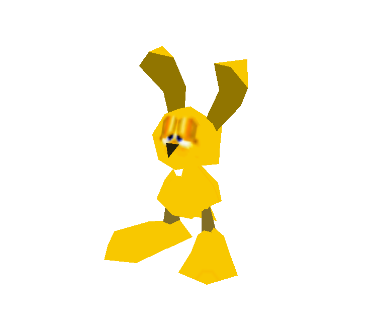

<!--Cabeçalho e imagem -->

    <h1><b> Welcome to the HEX </b></h1>
    

<!-- Contato -->
### Redes 

<!-- MIPS E ABOUT -->

    <h2>Sobre mim</h2>

<h3>
👋 Me chamo Nicolas  
🎓 Estudo Análise e Desenvolvimento de Sistemas pela Fatec Zona Leste  
💻 Apaixonado por tecnologia desde pequeno e atualmente seguindo carreira nessa área que está constantemente mudando a vida das pessoas
</h3>

#
 

## **Minhas Tecnologias**

    

## **Minhas Ferramentas**

    

 
 
 

#

 
